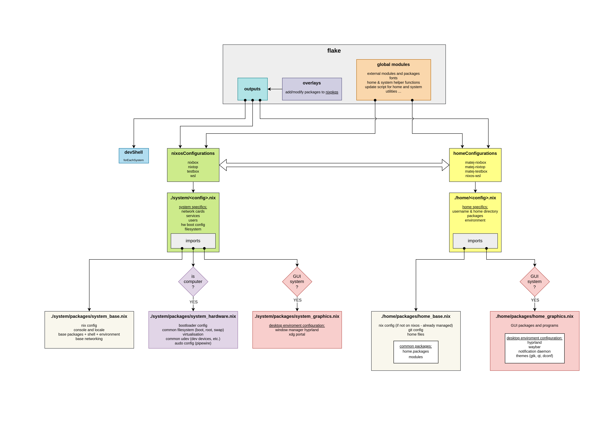

# NixOS configuration

This is my NixOS configuration repository.  
It contains system and user configuration files. System files in [system](./system) are used to build NixOS machine configurations and thus managing the state of the whole operating system.
Home files in [home](./home) are used to configure user applications and dotfiles managed by home-manager, which is installed either by system or manually on non-nixos platforms.  
More info on [nixos website](https://nixos.org).  
Old readme can be found [here](./README_DETAILED.md).

## Install NixOS

To install NixOS on a machine, follow the steps in the [nixos manual](./docs/nixos.md).

## Install Nix on non-NixOS system

To install NIX on non-NixOS system (Linux), follow the steps in the [nix manual](./docs/nix.md).

## Install home-manager on non-NixOS system

If you have NIX installed on your Linux distro, you can install and use home-manager to manage packages and configurations (dotfiles) for user session. This way you can have the same set of user config files for NixOS and non-NixOS systems (reproducible environment).  
Follow the steps in [home-manager manual](./docs/home.md).

## Maintenance

For maintenance of both system and home I created two scripts, each installed by their manager: `nixos-update` and `home-update`.  
Both scripts build the derivation, show the diff and ask for confirmation. System update requires sudo.  
Both scripts also accept option `-r`, which updates the flake lock file and thus does a system update instead of just rebuild.  
Other flags and options are passed on to the nix build command, excluding `-r` if present.  

You can read more on each script in the docs for [NixOS](./docs/nixos.md) and [home-manager](./docs/home.md).

## Wallpaper

I found it on internet some time ago, but it was bad quality. I turned it into vector image and exported 1080p and 1440p variants. If you find the author please thank him/her in my name.
